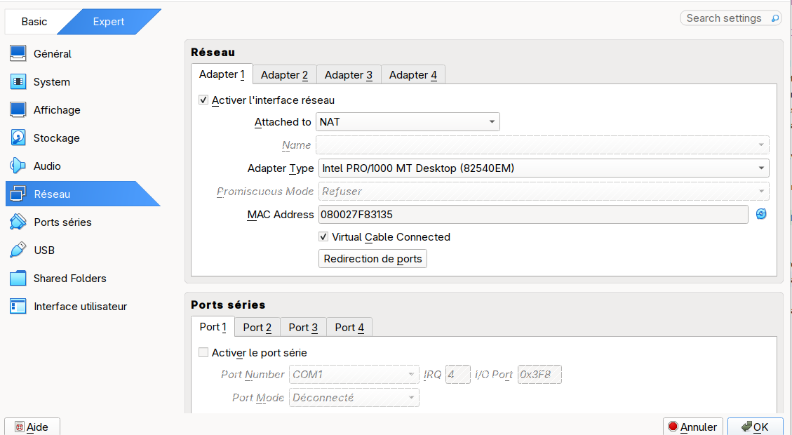
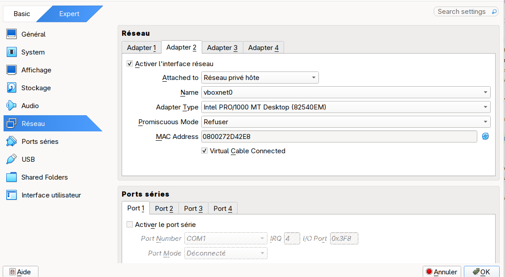

= Podman scafolder

== Oracle VM installation

=== Installation

* VM name: **local-lab**
* CPU: **4**
* Memory: **8192MB**
* Disk: **20Go**
* Image to use: **Fedora-Server-dvd-x86_64-43-1.6.iso**

activate Nested VT-x/AMD-V

[source,shell]
----
VBoxManage modifyvm local-lab --nested-hw-virt on
----

Network:

* Adapter 1: NAT
+

* Adapter 2: Bridged network
+

Create a user named having root privilegies: **local**

locate Guest ip from guest:
[source,shell]
----
ifconfig | grep enp0s8 -A 1
----

In my case: **192.168.59.116**

If no password has been defined for local user these actions must be done in VM:

[source,shell]
----
sudo vi /etc/ssh/sshd_config
----

Activate and define **PermitEmptyPasswords** to **yes**

restart the sshd service
[source,shell]
----
sudo systemctl restart ssh
----

NOTE: do it only for a local machine !

next connect using ssh from the host
[source,shell]
----
ssh local@192.168.59.116
----

install podman with stuffs and activate it
[source,shell]
----
sudo dnf install podman podman-compose skopeo -y
sudo systemctl enable --now podman
----

=== Registry installation

A Docker registry will be running inside the VM to hold the last version of services

From the host the image will be build and push to the Registry in VM.

Create folder for the Registry inside the VM
[source,shell]
----
sudo mkdir -p /srv/registry/data
sudo semanage fcontext -a -t container_file_t "/srv/registry(/.*)?"
sudo restorecon -R -v /srv/registry
----

Start registry from VM: DEPRECATED see Quadlet paragraph
[source,shell]
----
sudo podman run -d --name registry -p 5000:5000 -v /srv/registry/data:/var/lib/registry docker.io/library/registry:2
----

copy image inside registry from VM
[source,shell]
----
skopeo copy docker://hashicorp/http-echo:0.2.3 docker://localhost:5000/hashicorp/http-echo:0.2.3 --dest-tls-verify=false
----

=== Hello worlds sample

Goal:
* install two hello world applications
* first one reachable at **http://hello.local-lab.com:8080** and display **hello world from hello.local-lab.com**
* second one reachable at **http://hello2.local-lab.com:8080** and display **hello world from hello2.local-lab.com**

==== VM Configuration and run

Configure pull of images from insecure localhost registry from VM
[source,shell]
----
mkdir -p ~/.config/containers
cat > ~/.config/containers/registries.conf <<EOF
[[registry]]
location = "localhost:5000"
insecure = true
EOF
----
Configure pull of images from insecure localhost registry from VM for Podman rootful (without it podman kube will not work)
[source,shell]
----
sudo tee /etc/containers/registries.conf >/dev/null <<'EOF'
[[registry]]
location = "localhost:5000"
insecure = true
EOF
----

Start docker compose from VM: DEPRECATED see Quadlet paragraph
[source,shell]
----
podman compose -f docker-compose.yaml up -d
----

Disable firewall on 8080 from VM to make it accessible from Host
[source,shell]
----
sudo firewall-cmd --add-port=8080/tcp --permanent
sudo firewall-cmd --reload
----

Stop and clean from VM
[source,shell]
----
podman compose -f docker-compose.yaml down
----

==== HOST Configuration and test

Add **dns entries** inside **/etc/hosts**
[source,shell]
----
echo "192.168.59.116 hello.local-lab.com" | sudo tee -a /etc/hosts
echo "192.168.59.116 hello2.local-lab.com" | sudo tee -a /etc/hosts
----

Call hello
[source,shell]
----
curl http://hello.local-lab.com:8080
----

Call hello2
[source,shell]
----
curl http://hello2.local-lab.com:8080
----

=== Quadlet

Troubleshoot

[source,shell]
----
sudo /usr/libexec/podman/quadlet -dryrun
----

[source,shell]
----
/usr/libexec/podman/quadlet -user -dryrun
----

[source,shell]
----
podman network ls
----

==== Registry

[source,shell]
----
sudo tee /etc/containers/systemd/registry.container >/dev/null <<'EOF'
[Unit]
Description=Local Podman Registry

[Container]
Image=docker.io/library/registry:2
ContainerName=registry

# Ports
PublishPort=5000:5000

# Volume
Volume=/srv/registry/data:/var/lib/registry:Z

[Install]
WantedBy=multi-user.target
EOF
sudo systemctl daemon-reload
sudo systemctl start registry.service
----

==== lab

[source,shell]
----
sudo tee /etc/containers/systemd/hello1.container >/dev/null <<'EOF'
[Unit]
Description=hello1 container

[Container]
Image=localhost:5000/hashicorp/http-echo:0.2.3
ContainerName=hello1
Exec=-text="Hello from hello1"
Network=systemd-labnet

[Install]
WantedBy=multi-user.target
EOF
sudo tee /etc/containers/systemd/hello2.container >/dev/null <<'EOF'
[Unit]
Description=hello2 container

[Container]
Image=localhost:5000/hashicorp/http-echo:0.2.3
ContainerName=hello2
Exec=-text="Hello from hello2"
Network=systemd-labnet

[Install]
WantedBy=multi-user.target
EOF

sudo tee /etc/containers/systemd/nginx.container >/dev/null <<'EOF'
[Unit]
Description=nginx container

[Container]
Image=nginx:latest
ContainerName=nginx
PublishPort=8080:80
Volume=/etc/containers/systemd/nginx.conf:/etc/nginx/conf.d/default.conf:Z
Network=systemd-labnet

[Install]
WantedBy=multi-user.target
EOF

sudo tee /etc/containers/systemd/labnet.network >/dev/null <<'EOF'
[Network]
Driver=bridge
EOF

sudo tee /etc/containers/systemd/nginx.conf >/dev/null <<'EOF'
server {
    listen 80;
    server_name hello.local-lab.com;
    location / {
        proxy_pass http://hello1:5678;
    }
}

server {
    listen 80;
    server_name hello2.local-lab.com;
    location / {
        proxy_pass http://hello2:5678;
    }
}
EOF
sudo systemctl daemon-reload
sudo systemctl start labnet-network
sudo systemctl start hello1.service
sudo systemctl start hello2.service
sudo systemctl start nginx.service
----
